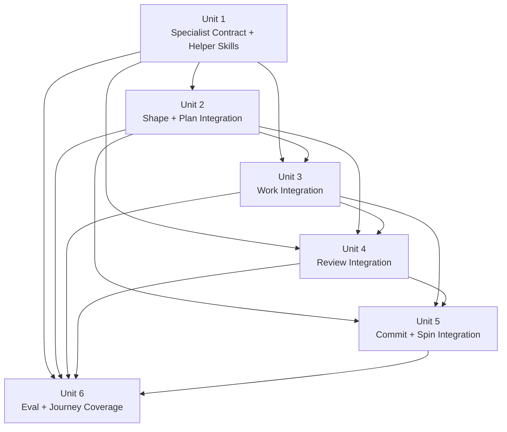

# Flywheel Architecture And Code-Quality Skill Suite Plan

## Overview

This plan adds a Flywheel-native specialist suite for architecture strategy,
pattern recognition, maintainability, and simplification without expanding the
public workflow backbone beyond `shape -> work -> review -> commit`.

The target outcome is:

- four direct-call helper skills:
  - `architecture-strategy`
  - `pattern-recognition`
  - `maintainability`
  - `simplify`
- shared references for activation heuristics, prompt structure, and pattern
  families that stage skills can load conditionally
- stronger `brainstorm`, `plan`, and `work` behavior so architecture and code
  quality are handled inside the existing workflow rather than in a new visible
  stage
- a stronger review specialist suite, including a new pattern-recognition
  persona and internal quality-dimension tracking for simplicity,
  maintainability, architecture fit, and pattern justification
- commit and spin behavior that preserve only the material architecture and
  code-quality story
- additive eval coverage for the helper skills and for one cross-stage
  architecture-bearing workflow

## Problem Frame

Flywheel already has a good compact workflow shape and some relevant internal
seams:

- `skills/work/SKILL.md` already reserves a simplification pass during
  execution
- `skills/review/references/reviewer-registry.yaml` already includes
  `maintainability`, `architecture`, and `simplicity` review personas
- the eval harness already supports both per-skill packs and additive journey
  suites

The missing piece is not another user-visible stage. The missing piece is a
coherent specialist layer that can:

- decide when patterns such as DDD, DTOs, ports/adapters, repository,
  builder, hexagonal boundaries, and distributed-system patterns are justified
- preserve those decisions across shaping, planning, execution, review,
  commit, and spin
- simplify and maintain code quality during execution rather than only at the
  final review gate
- tune those specialist prompts and schemas for current frontier reasoning
  models instead of relying on generic prompt folklore

See origin:
`docs/brainstorms/2026-04-22-flywheel-architecture-and-code-quality-skill-suite-requirements.md`.

## Requirements Trace

- R1-R8. Integrate architecture and code-quality specialists into the existing
  `spec -> plan -> work -> review -> commit -> spin` lifecycle without adding
  a new mandatory visible stage, while preserving commit and spin handoffs.
- R9-R13. Provide Flywheel-native specialist surfaces for simplicity,
  maintainability, pattern recognition, and architecture strategy, covering the
  named pattern families and explicitly helping Flywheel decide when not to use
  them.
- R14-R19. Define conditional activation rules and cross-stage handoffs so
  shaping, planning, execution, and review all use the right specialist at the
  right time.
- R20-R24. Tune prompts, schemas, model tiering, and evals for frontier-model
  effectiveness.
- R25-R27. Track simplicity, maintainability, architecture fit, and pattern
  justification in review synthesis without replacing the findings-first review
  contract.

## Scope Boundaries

- Do not add a new mandatory visible `architecture` stage to the public
  Flywheel backbone.
- Do not force DDD, hexagonal architecture, microservices, or other named
  patterns onto routine or low-complexity work by default.
- Do not copy Compound Engineering prompts or personas verbatim; adapt the role
  split into Flywheel's naming, refs, review contract, and eval model.
- Do not make simplification a blanket whole-repo cleanup pass on every task.
- Do not turn review scoring into the primary user-facing output.
- Do not expand this first pass into scheduled or continuous cleanup automation;
  the immediate scope is the interactive Flywheel workflow.

### Deferred to Separate Tasks

- Continuous or scheduled simplification automation modeled after GitHub Agentic
  Workflows: revisit after the interactive specialist suite proves useful.
- Wider host-specific model orchestration beyond Codex and Claude-oriented
  guidance: revisit after the core specialist suite and evals are stable.

## Context & Research

### Relevant Repo Truth

- No repo-root `AGENTS.md` or `CLAUDE.md` file exists in this checkout, so the
  main repo-grounded workflow contract lives in `README.md`, `skills/`, and the
  eval harness.
- `skills/work/SKILL.md` already includes `Simplify as You Go` and explicitly
  says to use a simplify skill if one exists.
- `skills/review/references/reviewer-registry.yaml` already includes
  `maintainability`, `architecture`, and `simplicity`, but not a distinct
  `pattern-recognition` persona.
- `skills/review/agents/openai.yaml`, `skills/plan/agents/openai.yaml`, and
  `skills/work/agents/openai.yaml` currently expose concise default prompts,
  and `skills/start/agents/openai.yaml`, `skills/brainstorm/agents/openai.yaml`,
  `skills/commit/agents/openai.yaml`, and `skills/spin/agents/openai.yaml`
  provide the same integration seam for routing and stage-level discoverability.
- `skills/start/SKILL.md`, `skills/brainstorm/SKILL.md`,
  `skills/plan/SKILL.md`, `skills/work/SKILL.md`, `skills/review/SKILL.md`,
  `skills/commit/SKILL.md`, and `skills/spin/SKILL.md` are the main workflow
  surfaces that will need to integrate this specialist suite, and
  `.codex-plugin/plugin.json` plus `plugins/flywheel/.codex-plugin/plugin.json`
  are the plugin-facing discovery surfaces that must stay aligned when new
  helper skills become directly callable.
- `scripts/flywheel-eval.js`, `evals/README.md`, and
  `tools/evals/src/scoring/index.cjs` already support additive eval packs and
  journey suites without requiring harness redesign.
- Existing deterministic scorers for `fw-plan`, `fw-work`, and `fw-review` are
  still coarse and will need strengthening to detect specialist-skill
  integration and review-quality dimensions.

### Relevant Durable Learnings

- `docs/solutions/developer-experience/journey-evals-without-a-harness-redesign-2026-04-19.md`
  shows the preferred pattern for adding cross-stage coverage additively rather
  than building a parallel eval platform.
- `docs/solutions/developer-experience/use-flywheel-start-as-the-router-entrypoint-2026-04-19.md`
  reinforces that helper surfaces should not bloat the public backbone or
  create namespace confusion.
- `docs/solutions/operational-guidance/shared-evidence-bundle-for-stage-handoffs-2026-04-19.md`
  reinforces artifact-forward handoffs instead of restating specialist findings
  in every later stage.

### External References

- Compound Engineering exposes the same broad role split the user requested:
  `ce-code-simplicity-reviewer`, `ce-maintainability-reviewer`,
  `ce-pattern-recognition-specialist`, and `ce-architecture-strategist`, plus a
  wider review-agent surface. That supports borrowing the role separation while
  still adapting it to Flywheel's repo shape.
- OpenAI's reasoning and evaluation guidance reinforces using stronger
  reasoning models for complex planning and synthesis, keeping prompts clear and
  direct, and treating evals as the main path for measuring quality and drift.
- Anthropic's prompting guidance reinforces structured prompts with XML-like
  tags, consistent tagging, prompt chaining for multi-step pipelines, and
  explicit guidance against overengineering.
- GitHub Agentic Workflows' `Continuous Simplicity` writeup reinforces a
  simplification pass focused on recent changes and concrete removable
  complexity rather than broad code-style policing.

## Key Technical Decisions

- **Create four direct-call helper skills.** The first implementation will add
  `skills/architecture-strategy/`, `skills/pattern-recognition/`,
  `skills/maintainability/`, and `skills/simplify/` as specialist helper
  surfaces. They are callable directly when asked for, but they remain helper
  surfaces inside the compact loop rather than new visible backbone stages.
- **Mirror helper skills into review personas instead of collapsing them.**
  `review` will keep existing `simplicity`, `maintainability`, and
  `architecture` personas, and gain a new `pattern-recognition` persona. The
  helper skills and personas should share reference material and output
  contracts, not diverge into two separate doctrines.
- **Use one shared reference pack for specialist behavior.** Add a shared
  reference area under `skills/references/architecture-code-quality/` for:
  - activation heuristics
  - frontier-model prompting guidance
  - pattern families and anti-pattern guidance
  - specialist output contracts
  This keeps stage skills and helper skills aligned without duplicating long
  instructions.
- **Keep architecture decisions inside the existing shaping artifact.**
  `brainstorm` captures architecture only when it materially changes scope or
  behavior. `plan` becomes the canonical place for `Architecture and Pattern
  Decisions`, including chosen options, rejected options, and clean-code
  constraints that `work` must carry forward.
- **Treat `simplify` as a work helper and a review pressure, not a new cleanup
  phase.** `work` should invoke `simplify` after abstraction-heavy units or
  every 2-3 units, while `review` remains the final check for unnecessary
  complexity.
- **Keep review scoring internal to synthesis.** Review will track simplicity,
  maintainability, architecture fit, and pattern justification as structured
  synthesis metadata or artifact fields, but the interactive user-facing output
  stays findings-first.
- **Add one new architecture-bearing journey suite instead of redesigning the
  harness.** Extend the existing eval harness with one additive journey suite
  that spans architecture-bearing shaping, planning, work, review, and finish
  behavior.
- **Keep model-specific tuning in helper refs and agent configs, not in one
  giant stage prompt.** This lets the repo evolve prompt structure and
  model-tiering without bloating the stage contracts.

## Testing Strategy

- **Project testing idioms:** This repo's main verification surface is the eval
  harness under `scripts/flywheel-eval.js`, `evals/`, and
  `tools/evals/src/scoring/`. There is no stronger repo-root test doctrine in
  `AGENTS.md` or `CLAUDE.md`, so the plan should use additive eval coverage and
  deterministic scorer updates as the primary regression mechanism.
- **Posture selection rule:** Use `tdd` for behavior-bearing skill-contract,
  persona-registry, scoring, and helper-skill changes that can be proven with
  prompt-eval and journey-eval cases. Use `characterization` only where the
  first useful move is to pin current wording or output shape before tightening
  it. Use `no-new-tests` only for purely documentary or schema-adjacent
  follow-through already covered by the same unit's eval changes.
- **Plan-level posture mix:** Units 1-6 should all use `tdd` because they
  change externally visible skill behavior, review behavior, or eval behavior.
  Documentation-only edits inside those units can ride on the same eval proof
  rather than creating separate test surfaces.
- **Material hypotheses:**
  - Narrow specialist helper skills plus shared references will produce more
    reliable architecture and code-quality guidance than one generic clean-code
    layer.
  - Adding explicit architecture and pattern-decision sections to shaping and
    planning will improve execution and review handoffs without adding a new
    visible stage.
  - A dedicated `simplify` helper invoked during work will reduce unnecessary
    complexity before final review.
  - A new `pattern-recognition` review persona plus internal quality-dimension
    tracking will improve review synthesis without making output feel mechanical.
  - Additive helper-skill and journey evals will be enough to protect the new
    workflow without redesigning the harness.
- **Red -> green proof points:**
  - Red: new helper-skill eval cases fail because those skills do not exist or
    do not yet produce specialist-appropriate outputs.
  - Red: existing `fw-plan`, `fw-work`, `fw-review`, `fw-commit`, `fw-spin`,
    and `flywheel` suites miss architecture, simplification, and scoring
    expectations.
  - Green: helper-skill suites pass, updated stage suites pass, and the new
    journey suite validates the intended cross-stage flow.
- **Tooling assumption:** Use the existing eval harness and scorer registry.
  Avoid introducing a second test runner or a second evaluation framework.
- **Public contracts to protect:** the compact visible loop, helper-skill
  optionality, findings-first review, repo-relative docs and plan artifacts,
  and the current finish-stage path of review -> commit -> conditional spin.
- **Primary test surfaces:**
  - `evals/flywheel/`
  - `evals/fw-brainstorm/`
  - `evals/fw-plan/`
  - `evals/fw-work/`
  - `evals/fw-review/`
  - `evals/fw-commit/`
  - `evals/fw-spin/`
  - `evals/architecture-strategy/`
  - `evals/pattern-recognition/`
  - `evals/maintainability/`
  - `evals/simplify/`
  - `evals/flywheel-architecture-change/`
- **Test patterns to mirror:**
  - `skills/logging/` and `skills/observability/` for focused helper-skill
    structure
  - `skills/review/references/reviewer-registry.yaml` for persona extension
  - `docs/solutions/developer-experience/journey-evals-without-a-harness-redesign-2026-04-19.md`
    for cross-stage eval coverage
  - current deterministic scorer registration in
    `tools/evals/src/scoring/index.cjs`

## Open Questions

### Resolved During Planning

- Should Flywheel add a new visible architecture stage? No. Keep the compact
  loop intact and integrate specialists inside shaping, planning, work, review,
  commit, and spin.
- Should the first implementation create specialist helper skills or only
  review personas? Create helper skills and mirror them into review personas so
  the same specialist split exists across planning, work, and review.
- Should review scoring become a user-facing scorecard? No. Keep scoring
  internal to synthesis and artifacts; keep findings primary in user-facing
  output.
- Should this first pass include continuous or scheduled cleanup automation?
  No. Strengthen the interactive workflow first.

### Deferred to Implementation

- Exact shared-reference filenames inside
  `skills/references/architecture-code-quality/`, as long as the split covers
  activation, prompting, pattern families, and output contracts.
- Exact field names and placement for internal review quality-dimension
  metadata in artifacts or synthesis output.
- Exact few-shot example count and example placement per specialist prompt once
  the first eval runs show where zero-shot plus schema is insufficient.
- Exact model defaults per helper and per host after the first eval sweep
  measures cost/latency/quality tradeoffs.

## Output Structure

    docs/
      brainstorms/
        2026-04-22-flywheel-architecture-and-code-quality-skill-suite-requirements.md
      plans/
        2026-04-22-001-feat-flywheel-architecture-and-code-quality-skill-suite-plan.md
    evals/
      architecture-strategy/
      maintainability/
      pattern-recognition/
      simplify/
      flywheel-architecture-change/
      flywheel/
      fw-brainstorm/
      fw-plan/
      fw-work/
      fw-review/
      fw-commit/
      fw-spin/
    skills/
      architecture-strategy/
        SKILL.md
        agents/
          openai.yaml
      maintainability/
        SKILL.md
        agents/
          openai.yaml
      pattern-recognition/
        SKILL.md
        agents/
          openai.yaml
      simplify/
        SKILL.md
        agents/
          openai.yaml
      references/
        architecture-code-quality/
      review/
        SKILL.md
        agents/
          openai.yaml
        references/
          reviewer-registry.yaml
          review-output-template.md
          synthesis-and-presentation.md
          findings-schema.json
          personas/
            architecture.md
            maintainability.md
            pattern-recognition.md
            simplicity.md
      brainstorm/
        SKILL.md
        agents/
          openai.yaml
        references/
      plan/
        SKILL.md
        agents/
          openai.yaml
        references/
      start/
        SKILL.md
        agents/
          openai.yaml
      work/
        SKILL.md
        agents/
          openai.yaml
      commit/
        SKILL.md
        agents/
          openai.yaml
      spin/
        SKILL.md
        agents/
          openai.yaml
        references/
    tools/
      evals/
        src/
          scoring/
    .codex-plugin/
      plugin.json
    plugins/
      flywheel/
        .codex-plugin/
          plugin.json

## High-Level Technical Design

> *This illustrates the intended approach and is directional guidance for review, not implementation specification.*

| Stage | Specialist triggers | Specialist surfaces | Output carried forward |
|---|---|---|---|
| `brainstorm` / requirements | boundary decisions, service shape, domain invariants, integration seams | `architecture-strategy`, `pattern-recognition` | technical direction only when it materially affects scope or behavior |
| `plan` | architecture-bearing work, pattern choice, rejected-alternative analysis | `architecture-strategy`, `pattern-recognition`, `maintainability` | `Architecture and Pattern Decisions`, clean-code constraints, test posture |
| `work` | abstraction-heavy unit, wrappers/helpers/orchestration, architecture drift | `simplify`, `maintainability`, `architecture-strategy` | simplified implementation shape or explicit reroute when the plan no longer fits repo truth |
| `review` | non-trivial code changes, pattern-heavy diffs, boundary changes | `simplicity`, `maintainability`, `pattern-recognition`, `architecture` | findings-first verdict plus internal quality-dimension tracking |
| `commit` | material architecture or code-quality story worth preserving | stage-native commit synthesis | PR-safe summary only |
| `spin` | durable lessons about chosen/rejected patterns or simplification wins | stage-native spin capture | searchable project guidance |

## Implementation Units

- [ ] **Unit 1: Establish the specialist contract and direct-call helper skills**

**Goal:** Create the Flywheel-native helper skills, shared specialist
references, and direct-call eval surfaces for architecture strategy, pattern
recognition, maintainability, and simplification.

**Requirements:** [R1, R2, R9, R10, R11, R12, R20, R21, R22]

**Dependencies:** None

**Files:**
- Create: `skills/architecture-strategy/SKILL.md`
- Create: `skills/architecture-strategy/agents/openai.yaml`
- Create: `skills/pattern-recognition/SKILL.md`
- Create: `skills/pattern-recognition/agents/openai.yaml`
- Create: `skills/maintainability/SKILL.md`
- Create: `skills/maintainability/agents/openai.yaml`
- Create: `skills/simplify/SKILL.md`
- Create: `skills/simplify/agents/openai.yaml`
- Create: `skills/references/architecture-code-quality/activation-heuristics.md`
- Create: `skills/references/architecture-code-quality/frontier-model-prompting.md`
- Create: `skills/references/architecture-code-quality/pattern-families.md`
- Create: `skills/references/architecture-code-quality/output-contract.md`
- Create: `evals/architecture-strategy/manifest.json`
- Create: `evals/architecture-strategy/cases.jsonl`
- Create: `evals/architecture-strategy/rubric.md`
- Create: `evals/pattern-recognition/manifest.json`
- Create: `evals/pattern-recognition/cases.jsonl`
- Create: `evals/pattern-recognition/rubric.md`
- Create: `evals/maintainability/manifest.json`
- Create: `evals/maintainability/cases.jsonl`
- Create: `evals/maintainability/rubric.md`
- Create: `evals/simplify/manifest.json`
- Create: `evals/simplify/cases.jsonl`
- Create: `evals/simplify/rubric.md`
- Modify: `tools/evals/src/scoring/index.cjs`
- Create: `tools/evals/src/scoring/architecture-strategy.cjs`
- Create: `tools/evals/src/scoring/pattern-recognition.cjs`
- Create: `tools/evals/src/scoring/maintainability.cjs`
- Create: `tools/evals/src/scoring/simplify.cjs`
- Modify: `evals/README.md`

**Test posture:** `tdd` -- These are new user-callable helper surfaces whose
behavior is best locked in through dedicated eval packs before the prompts and
refs settle.

**Approach:**
- Model the new helper skills on focused existing helpers such as `logging` and
  `observability`: narrow remit, explicit suppressions, and repo-grounded
  evidence requirements.
- Keep the shared reference pack authoritative for activation heuristics,
  frontier-model prompting, and pattern-family guidance instead of duplicating
  large blocks of doctrine in each helper skill.
- Add helper-local references only if a later eval failure proves the shared
  pack is insufficient for a specific specialist.
- Encode direct-call behavior in dedicated helper-skill eval packs so the
  specialist suite is provable independently of stage integration.

**Execution note:** Keep helper skills directly callable but avoid promoting
them as new visible backbone stages in `README.md`.

**Patterns to follow:**
- `skills/logging/SKILL.md`
- `skills/observability/SKILL.md`
- `skills/review/references/reviewer-registry.yaml`

**Test scenarios:**
- `architecture-strategy` evaluates boundary, dependency, and service-shape
  choices without defaulting to microservices or abstract clean-architecture
  taste.
- `pattern-recognition` identifies applicable pattern families and anti-patterns
  and explains when a simpler local design is better.
- `maintainability` focuses on future edit cost, naming, cohesion, and
  reducible structure rather than generic style commentary.
- `simplify` proposes concrete removable or collapsible complexity in recent
  code or changed areas without widening scope into a whole-repo cleanup pass.
- All four helpers use structured output and repo-grounded evidence rather than
  vague roleplay.

**Red signal:** New helper-skill eval cases fail because the skills are absent,
too broad, or do not produce specialist-shaped outputs.

**Green signal:** The new helper-skill suites pass and their outputs are narrow,
evidence-bound, and differentiated by remit.

**Verification:**
- `evals/README.md` lists the new helper-skill suites cleanly and the scorer
  registry resolves them without harness-level errors.

- [ ] **Unit 2: Integrate architecture and pattern decisions into shaping and planning**

**Goal:** Make shaping and planning capture architecture-bearing decisions
inside the existing workflow without creating a new visible stage.

**Requirements:** [R1, R2, R3, R4, R10, R11, R13, R14, R15, R18, R20, R21]

**Dependencies:** Unit 1

**Files:**
- Modify: `README.md`
- Modify: `skills/start/SKILL.md`
- Modify: `skills/start/agents/openai.yaml`
- Modify: `skills/brainstorm/SKILL.md`
- Modify: `skills/brainstorm/agents/openai.yaml`
- Modify: `skills/brainstorm/references/requirements-capture.md`
- Modify: `skills/brainstorm/references/brainstorm-examples.md`
- Modify: `skills/plan/SKILL.md`
- Modify: `skills/plan/agents/openai.yaml`
- Modify: `skills/plan/references/unit-examples.md`
- Modify: `skills/plan/references/deepening-workflow.md`
- Modify: `skills/plan/references/plan-handoff.md`
- Modify: `.codex-plugin/plugin.json`
- Modify: `plugins/flywheel/.codex-plugin/plugin.json`
- Modify: `evals/flywheel/cases.jsonl`
- Modify: `evals/fw-brainstorm/cases.jsonl`
- Modify: `evals/fw-brainstorm/rubric.md`
- Modify: `evals/fw-plan/cases.jsonl`
- Modify: `evals/fw-plan/rubric.md`
- Modify: `tools/evals/src/scoring/flywheel.cjs`
- Modify: `tools/evals/src/scoring/fw-brainstorm.cjs`
- Modify: `tools/evals/src/scoring/fw-plan.cjs`

**Test posture:** `tdd` -- This changes visible shaping and planning behavior,
including the plan template and router contract, and should be driven by eval
cases that fail before the wording changes land.

**Approach:**
- Keep the public backbone unchanged while allowing `start` to route direct
  helper invocations when the user explicitly asks for architecture,
  simplification, maintainability, or pattern help.
- Teach `brainstorm` to capture architecture direction only when it materially
  affects scope or behavior.
- Add a first-class `Architecture and Pattern Decisions` section to plan docs
  for architecture-bearing work, covering chosen patterns, rejected
  alternatives, and implementation constraints that `work` must preserve.
- Reuse the shared specialist refs from Unit 1 rather than embedding large
  model or pattern doctrine directly into the stage prompts.

**Execution note:** Preserve the planning boundary; `plan` should still decide
how to build, not start executing architecture work.

**Technical design:** *(directional guidance, not implementation specification)*
- Stage integration should load helpers by rule:
  - `start`: direct helper routing only on explicit asks
  - `brainstorm`: architecture/pattern helper only when scope or behavior
    depends on the decision
  - `plan`: architecture/pattern helper when boundary, abstraction, or service
    shape is materially in play

**Patterns to follow:**
- `skills/start/SKILL.md`
- `skills/brainstorm/SKILL.md`
- `skills/plan/SKILL.md`

**Test scenarios:**
- A technical brainstorm captures architecture direction only when it affects
  scope or behavior.
- A plan for architecture-bearing work names chosen and rejected patterns and
  ties them to concrete implementation constraints.
- `start` preserves the compact loop while allowing explicit direct helper
  routing.
- Plan handoff remains document-review -> `deepen` / `work` rather than
  collapsing into execution.

**Red signal:** Existing `flywheel`, `fw-brainstorm`, or `fw-plan` cases fail
  because Flywheel still treats architecture as either absent or as a separate
  visible stage.

**Green signal:** Updated shaping and planning suites pass with the compact loop
  intact and architecture-bearing decisions captured inside the existing
  artifacts.

**Verification:**
- The plan template remains readable for non-architecture work and only adds
  the specialist section conditionally.

- [ ] **Unit 3: Integrate execution-time simplification and maintainability checks**

**Goal:** Turn `work`'s existing simplification seam into an explicit helper
integration point and give execution a clean way to react when planned
architecture no longer fits repo truth.

**Requirements:** [R5, R10, R12, R14, R16, R19, R20, R21]

**Dependencies:** Unit 1, Unit 2

**Files:**
- Modify: `skills/work/SKILL.md`
- Modify: `skills/work/agents/openai.yaml`
- Modify: `skills/work/references/commit-workflow.md`
- Modify: `evals/fw-work/cases.jsonl`
- Modify: `evals/fw-work/rubric.md`
- Modify: `tools/evals/src/scoring/fw-work.cjs`

**Test posture:** `tdd` -- The execution contract is behavior-bearing and can
be locked down with work-stage evals before the wording changes.

**Approach:**
- Make `simplify` the default helper when abstraction-heavy or wrapper-heavy
  units land during execution.
- Allow `maintainability` to activate when the work adds coupling, multi-file
  orchestration, or higher future-edit cost.
- When implementation truth invalidates an earlier pattern or boundary decision,
  route through the relevant specialist helper instead of silently drifting away
  from the plan.
- Keep simplification bounded to the changed work or changed units, not as a
  general cleanup pass.

**Execution note:** Preserve scope discipline; simplification should remove or
localize complexity, not broaden the feature set or refactor unrelated code.

**Patterns to follow:**
- `skills/work/SKILL.md`
- `skills/observability/SKILL.md`
- `skills/logging/SKILL.md`

**Test scenarios:**
- `work` mentions or invokes `simplify` after abstraction-heavy units.
- `work` surfaces maintainability pressure when wrappers/helpers/orchestration
  increase.
- `work` explicitly handles plan-vs-repo-truth conflicts for architecture or
  pattern decisions.
- `work` preserves review and commit as downstream stages rather than turning
  helper invocation into a new visible workflow.

**Red signal:** `fw-work` cases fail because execution still treats
  simplification as optional prose or ignores architecture drift.

**Green signal:** `fw-work` passes with explicit simplify/maintainability
  activation and bounded rerouting when the plan no longer fits repo truth.

**Verification:**
- Execution guidance still reads like repo work, not generic cleanup
  orchestration.

- [ ] **Unit 4: Extend review with pattern recognition and internal quality dimensions**

**Goal:** Make review treat simplicity, maintainability, pattern
justification, and architecture fit as a coordinated specialist suite while
keeping the output findings-first.

**Requirements:** [R6, R10, R14, R17, R18, R21, R25, R26, R27]

**Dependencies:** Unit 1, Unit 2, Unit 3

**Files:**
- Modify: `skills/review/SKILL.md`
- Modify: `skills/review/agents/openai.yaml`
- Modify: `skills/review/references/reviewer-registry.yaml`
- Modify: `skills/review/references/persona-loading.md`
- Modify: `skills/review/references/findings-schema.json`
- Modify: `skills/review/references/synthesis-and-presentation.md`
- Modify: `skills/review/references/review-output-template.md`
- Modify: `skills/review/references/personas/architecture.md`
- Modify: `skills/review/references/personas/maintainability.md`
- Modify: `skills/review/references/personas/simplicity.md`
- Create: `skills/review/references/personas/pattern-recognition.md`
- Modify: `evals/fw-review/cases.jsonl`
- Modify: `evals/fw-review/rubric.md`
- Modify: `tools/evals/src/scoring/fw-review.cjs`

**Test posture:** `tdd` -- Review behavior and synthesis formatting are
externally visible and should be driven by failing review-stage eval cases.

**Approach:**
- Add `pattern-recognition` as a new review persona with a narrow remit:
  identify justified patterns, anti-patterns, and mismatches between the diff
  and repo-grounded pattern use.
- Strengthen existing simplicity, maintainability, and architecture personas so
  they suppress overlap and cite concrete evidence.
- Add internal quality-dimension tracking for simplicity, maintainability,
  architecture fit, and pattern justification in review synthesis or artifacts,
  while preserving the current findings-first interactive report.
- Keep review output tables and verdict structure stable unless a change is
  required to surface the new specialist suite clearly.

**Execution note:** Avoid turning review into a scoreboard; dimensions should
  guide synthesis and prioritization rather than replacing the finding list.

**Technical design:** *(directional guidance, not implementation specification)*
- Specialist review flow:
  - baseline reviewers always run
  - specialist personas run by diff evidence
  - synthesis deduplicates overlapping findings
  - quality-dimension metadata is stored separately from the interactive
    findings tables

**Patterns to follow:**
- `skills/review/references/reviewer-registry.yaml`
- `skills/review/references/review-output-template.md`
- `skills/review/references/personas/architecture.md`

**Test scenarios:**
- Review activates `pattern-recognition` when pattern-heavy or boundary-changing
  diffs are in scope.
- Simplicity, maintainability, architecture, and pattern-recognition findings do
  not duplicate one another mechanically.
- Review keeps findings primary and commit handoff intact.
- Review scoring or dimension tracking stays internal and does not replace the
  verdict-oriented report shape.

**Red signal:** `fw-review` cases fail because the specialist suite is missing,
  duplicates findings excessively, or makes output feel mechanical.

**Green signal:** `fw-review` passes with a legible specialist suite, clean
  commit handoff, and internal quality-dimension support.

**Verification:**
- Review output still follows the established template and remains readable in
  interactive mode.

- [ ] **Unit 5: Integrate commit and spin with architecture and code-quality story**

**Goal:** Carry only the material architecture/code-quality story into
`commit` and make `spin` capable of storing durable lessons about chosen or
rejected patterns and simplification wins.

**Requirements:** [R7, R8, R18, R25, R26]

**Dependencies:** Unit 2, Unit 3, Unit 4

**Files:**
- Modify: `skills/commit/SKILL.md`
- Modify: `skills/commit/agents/openai.yaml`
- Modify: `skills/commit/references/evidence-bundle.md`
- Modify: `skills/spin/SKILL.md`
- Modify: `skills/spin/agents/openai.yaml`
- Modify: `skills/spin/references/schema.yaml`
- Modify: `skills/spin/references/yaml-schema.md`
- Modify: `evals/fw-commit/cases.jsonl`
- Modify: `evals/fw-commit/rubric.md`
- Modify: `tools/evals/src/scoring/fw-commit.cjs`
- Modify: `evals/fw-spin/cases.jsonl`
- Modify: `evals/fw-spin/rubric.md`
- Modify: `tools/evals/src/scoring/fw-spin.cjs`

**Test posture:** `tdd` -- Commit and spin behavior are visible workflow
contracts and should be proven through their existing eval packs.

**Approach:**
- Teach `commit` to summarize only the material architecture or code-quality
  story needed for a PR-safe narrative, not the raw specialist outputs.
- Teach `spin` to recognize durable lessons around:
  - patterns that paid off
  - patterns rejected as unnecessary
  - simplification heuristics that reduced durable complexity
  - maintainability lessons worth preserving for later work
- Reuse the evidence-bundle pattern where it helps later stages consume a
  concise specialist summary instead of raw artifacts.

**Execution note:** Keep finish-stage output concise; detailed specialist
  reasoning belongs in prior artifacts, not in PR narration.

**Patterns to follow:**
- `skills/commit/SKILL.md`
- `skills/commit/references/evidence-bundle.md`
- `skills/spin/references/schema.yaml`

**Test scenarios:**
- `commit` includes the material architecture/code-quality story only when it is
  relevant to the branch summary.
- `spin` can capture justified/rejected pattern choices and simplification
  heuristics as durable guidance.
- Neither stage replays the full review report or helper outputs verbatim.

**Red signal:** `fw-commit` or `fw-spin` cases fail because the finish-stage
  story ignores specialist outcomes or becomes too verbose and repetitive.

**Green signal:** Finish-stage suites pass with concise PR-safe summaries and
  durable lessons captured only when warranted.

**Verification:**
- Spin schema changes remain compatible with existing solution-document
  structure and do not require a separate knowledge store.

- [ ] **Unit 6: Add cross-stage eval coverage for architecture-bearing workflow**

**Goal:** Add additive regression coverage for the new specialist suite across a
realistic architecture-bearing workflow without redesigning the eval harness.

**Requirements:** [R18, R20, R21, R22, R23, R24, R25, R26]

**Dependencies:** Unit 1, Unit 2, Unit 3, Unit 4, Unit 5

**Files:**
- Create: `evals/flywheel-architecture-change/manifest.json`
- Create: `evals/flywheel-architecture-change/cases.jsonl`
- Create: `evals/flywheel-architecture-change/rubric.md`
- Create: `tools/evals/src/scoring/flywheel-architecture-change.cjs`
- Modify: `tools/evals/src/scoring/index.cjs`
- Modify: `evals/README.md`

**Test posture:** `tdd` -- The journey suite should begin as failing coverage
for the intended cross-stage flow and only pass after the specialist suite is
integrated end to end.

**Approach:**
- Follow the existing journey-suite pattern instead of redesigning the harness.
- Add one architecture-bearing journey that checks:
  - shaping captures architecture only when material
  - planning records pattern/boundary decisions explicitly
  - execution invokes simplification or maintainability pressure when the work
    becomes abstraction-heavy
  - review uses the specialist suite and keeps findings primary
  - commit/spin preserve only the material story
- Use the journey suite to calibrate overlap between direct helper-skill packs
  and stage-level evals.

**Execution note:** Keep the journey suite narrow and representative; avoid
  turning this into a second broad scenario-testing platform.

**Patterns to follow:**
- `docs/solutions/developer-experience/journey-evals-without-a-harness-redesign-2026-04-19.md`
- `evals/flywheel-runtime-change/`
- `evals/flywheel-incident-response/`

**Test scenarios:**
- A workflow that includes architecture-bearing decisions can stay within the
  compact loop and still use specialist helpers correctly.
- The helper-skill packs and the journey suite reinforce one another rather
  than checking unrelated behavior.
- Existing suite validation and summarization remain unchanged aside from the
  new additive suite registration.

**Red signal:** The new journey suite fails because the specialist suite does
  not yet hand off cleanly across shaping, planning, work, review, commit, and
  spin.

**Green signal:** The journey suite passes and the eval harness continues to
  validate, prepare, and summarize cleanly with additive coverage only.

**Verification:**
- The harness still works without any redesign or second scenario platform.

## System-Wide Impact

- **Interaction graph:** `start` routes into `brainstorm` and `plan`; shaping
  may load `architecture-strategy` and `pattern-recognition`; `work` may load
  `simplify`, `maintainability`, or architecture helpers; `review` uses the
  specialist suite; `commit` and `spin` consume only material outcomes.
- **Error propagation:** weak activation heuristics could over-trigger helper
  skills, while weak suppressions could create overlapping or noisy findings.
  The main mitigation is eval-driven tightening of trigger and suppression
  rules.
- **State lifecycle risks:** helper prompts, shared refs, reviewer registry,
  deterministic scorers, and skill docs could drift if not tied together by the
  shared reference pack and additive evals.
- **API surface parity:** `README.md`, the stage `SKILL.md` files, the affected
  stage `agents/openai.yaml` files, and the plugin manifests must agree on
  helper-skill posture and the compact loop.
- **Integration coverage:** direct helper-skill suites plus one journey suite
  are required; single-stage packs alone will not prove cross-stage handoff
  quality.
- **Unchanged invariants:** repo-relative paths, the compact visible backbone,
  findings-first review, and conditional post-commit spin remain intact.

## Risks & Dependencies

| Risk | Mitigation |
|------|------------|
| Four helper skills bloat the command surface and confuse routing | Keep them helper-class surfaces, update `start` only for explicit direct asks, and continue teaching `shape -> work -> review -> commit` as the visible backbone |
| Specialist prompts overlap and create duplicated review findings | Use a shared output contract, strengthen suppressions, and add explicit overlap checks in review synthesis and evals |
| Architecture guidance drifts into pattern cargo culting | Make rejected alternatives and "when not to use" guidance first-class in shared refs, plan sections, and eval criteria |
| Simplification broadens scope into whole-repo cleanup | Keep `simplify` focused on recent or changed work and assert that behavior in helper-skill and work-stage evals |
| Review scoring becomes too visible or mechanical | Keep quality dimensions internal to synthesis/artifacts and preserve findings-first interactive output |
| New evals pressure the harness into redesign | Follow the existing journey-suite pattern and add only one additive architecture-bearing journey suite |

## Documentation / Operational Notes

- Update `README.md` and `skills/start/SKILL.md` so helper skills are
  discoverable without turning them into new public backbone stages.
- Keep `.codex-plugin/plugin.json` and `plugins/flywheel/.codex-plugin/plugin.json`
  aligned with the same discoverability posture so plugin default prompts do not
  lag behind the stage docs.
- Keep model-specific prompt tactics in shared refs and agent configs so
  updates can happen without rewriting stage prompts.
- If direct helper invocation becomes too noisy in the public docs, prefer
  contributor-facing references over main workflow prose rather than removing
  the helper surfaces.

## Sources & References

- **Origin document:** [docs/brainstorms/2026-04-22-flywheel-architecture-and-code-quality-skill-suite-requirements.md](docs/brainstorms/2026-04-22-flywheel-architecture-and-code-quality-skill-suite-requirements.md)
- Related code: `skills/work/SKILL.md`
- Related code: `skills/review/references/reviewer-registry.yaml`
- Related code: `skills/start/SKILL.md`
- Related code: `skills/brainstorm/SKILL.md`
- Related code: `skills/plan/SKILL.md`
- Related code: `skills/review/SKILL.md`
- Related code: `skills/commit/SKILL.md`
- Related code: `skills/spin/SKILL.md`
- Related code: `scripts/flywheel-eval.js`
- Related code: `tools/evals/src/scoring/index.cjs`
- Related doc: `docs/solutions/developer-experience/journey-evals-without-a-harness-redesign-2026-04-19.md`
- External docs: `https://github.com/EveryInc/compound-engineering-plugin/blob/main/plugins/compound-engineering/README.md`
- External docs: `https://developers.openai.com/api/docs/guides/reasoning-best-practices`
- External docs: `https://developers.openai.com/api/docs/guides/evaluation-best-practices`
- External docs: `https://docs.anthropic.com/en/docs/build-with-claude/prompt-engineering/use-xml-tags`
- External docs: `https://platform.claude.com/docs/en/build-with-claude/prompt-engineering/claude-prompting-best-practices`
- External docs: `https://github.github.com/gh-aw/blog/2026-01-13-meet-the-workflows-continuous-simplicity/`
